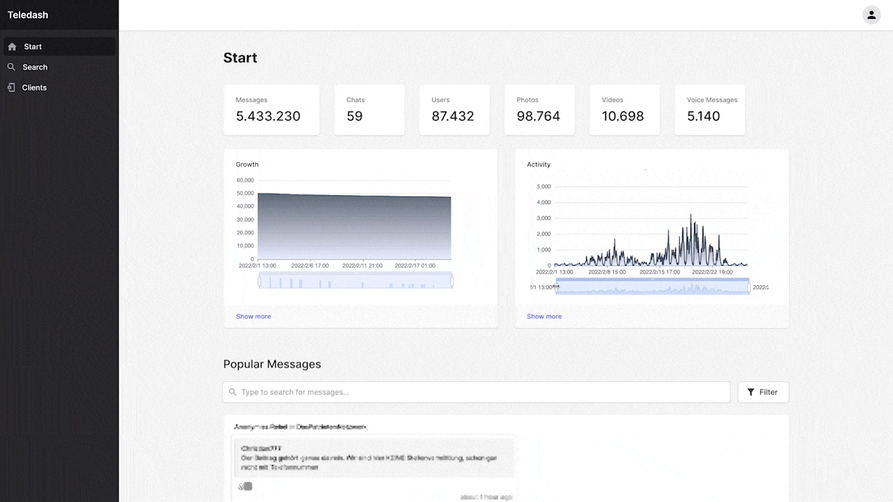

# Teledash
 *Research and analysis software for Telegram*

Teledash is a web application that simplifies research and analysis of the content on Telegram.



## Repositories

* [Frontend](https://github.com/democ-de/teledash-frontend)
* [Backend](https://github.com/democ-de/teledash-backend)

## Features
One or more Telegram accounts can be linked to Teledash. The content will be downloaded and processed periodically.

### Search 
With the help of the web interface, all channels, groups and chats can be searched with various parameters. For example, you can search for messages from a certain period in certain channels or messages from specific users.

### Text and speech recognition
Automated text recognition (OCR) is used to recognize and save text on images. In addition, voice messages can automatically be transcribed (ASR) in the background and stored as searchable text. The quality of the results depends strongly on the quality of the audio recording as well as the speech model used. Models for text as well as speech recognition can be manually improved or trained if necessary.

### Metrics
Teledash regularly collects statistical data on the activity and growth of channels and groups, enabling quantitative analysis.

### Storage
Media such as videos, photos, and voice messages can be automatically downloaded and stored in a MinIO instance or in S3-compatible cloud storage. 

### Export
All collected data can also be accessed and filtered via a REST API for further processing of the content by third-party software. API endpoints can be tested using Swagger. mongoexport optionally allows the export of complete data sets as CSV or JSON.

### Future development
Teledash will be further developed and tested in journalistic and scientific contexts in the future. Feel free to [get in touch](mailto:teledash@democ.de).

## Terminology
- __Chats__ are groups, supergroups and channels. (Private conversations won't be scraped and stored by teledash).
- __User__ are users and bots.
- __Messages__ are messages that contain text or media (attachments)

## Citation
Please cite Teledash in your publications if you used it for your research:
```BibTeX
@misc{teledash_2022, 
  title={Teledash – analysis and research software for Telegram}, 
  url={https://github.com/democ-de/teledash}, 
  author={Weichbrodt, Gregor and Stanjek, Grischa}, 
  year={2022}
} 
 ```

## Acknowledgements

* Funded from September 2021 until February 2022 by 